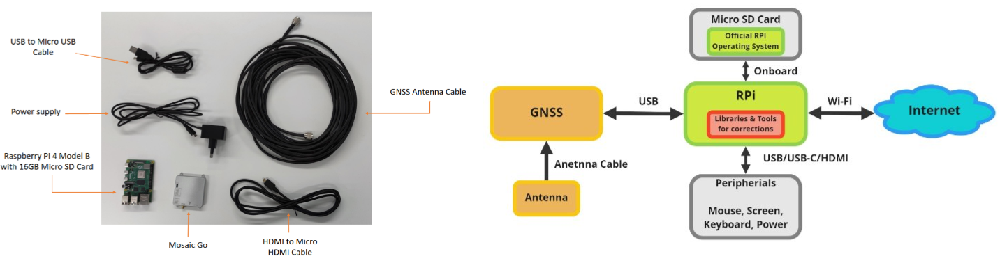
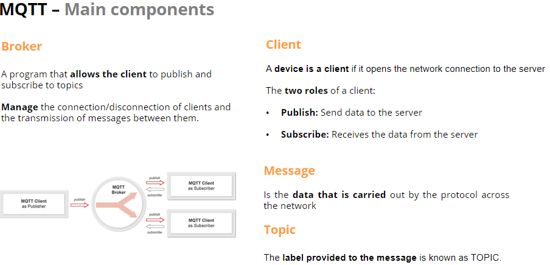
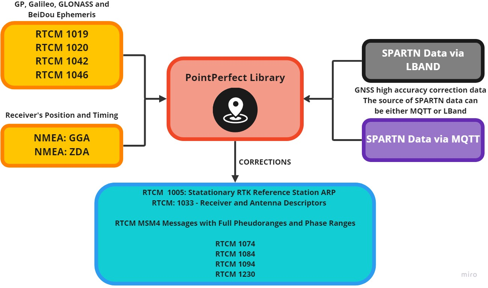
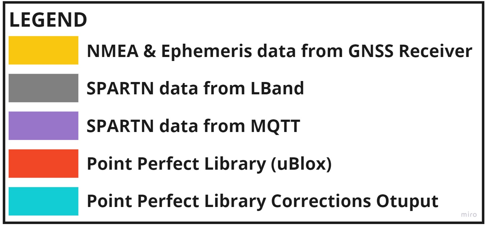

  
# Using Septentrio's Receiver and uBlox's Pointperfect correction services for precise positioning

## GENERAL CONTEXT OF THIS GUIDE

GNSS (Global Navigation Satellite System) technology has changed the way we navigate and position ourselves, with applications in various industries including transportation, surveying and agriculture. However, atmospheric conditions and signal blockages can affect the accuracy of GNSS location information. 

GNSS corrections are used to mitigate these effects and improve the accuracy of position measurements. In recent years, there has been a growing demand for high-accuracy positioning, which has led to the evolution of GNSS correction mechanisms such as OSR, SSR or LBand delivery. Standardization is not yet established, making it challenging for users to access and use these corrections. 

To address this challenge, it is useful to create an ecosystem around GNSS corrections that is agnostic. This repository is part of a set of guides and documentation and explores a way of running uBlox's Point Perfect corrections on your system quickly. Making it easy for users/integrators to evaluate and access these service. Platforms like Github enable documentation and the creation of demonstrators to allow users to try out different correction services with ease.

| <a href="https://github.com/septentrio-gnss/Septentrio_AgnosticCorrectionsProgram#set-up-guide-to-use-third-party-osr-and-ssr-correction-services-with-septentrios-receivers-for-precise-positioning">To access the GitHub homepage to which this guide belongs, click here</a>|
|---|

## AUTHORS
  
| Name | GitHub |
|------|--------|
| Iker Uranga | <a href="https://github.com/IkerUranga10">IkerUranga10</a>   |    
| Duck Jiang | <a href="https://github.com/duckjiang">duckjiang</a>   | 
| Luc Gousset | <a href="https://github.com/Luc-Gousset">Luc-Gousset</a>   |  

## MAINTAINER
  
| GitHub |
|--------|
| <a href="https://github.com/septentrio-users">septentrio-users</a>   |    

## DO YOU HAVE ANY QUESTIONS? CONTACT SEPTENTRIO SUPPORT TEAM

| <a href="https://web.septentrio.com/GH-SSN-support ">Septentrio Support Page</a>|
|---|

## SEPTENTRIO LINKS FOR USERS
 
| Contact                                                                          | Septentrio Home Page                                                        |
|----------------------------------------------------------------------------------|-----------------------------------------------------------------------------|
| <a href="https://web.septentrio.com/GH-SSN-contact ">Septentrio Contact Page</a> | <a href="https://web.septentrio.com/UBL-SSN-home">Septentrio Home Page</a> |

## DISCLAIMER
  
This set of guidelines consist of a several practical examplse to help Septentrio Module users and developers to integrate third party GNSS corrections. The guidelines are based on a concrete setup, which you may or may not use to follow the integration guidelines.

It is desirable to mention the disclaimer about that setup and the guides in general before starting reading this guide.
  
| <a href="https://github.com/septentrio-gnss/Septentrio_AgnosticCorrectionsProgram/tree/main/Receiver%20and%20Raspberry%20Setup#disclaimer">Click here to know more about the Setup in which these guides are based and general implementation documentation disclaimer</a> |
|---|

## TABLE OF CONTENTS

<!--ts-->

* [Introduction](#introduction)
* [Who is uBlox?](#who-is-ublox)
* [What is Pointperfect?](#what-is-pointperfect)
* [Is the project Open Source?](#is-the-project-open-source)
* [Receiver and Raspberry Pi 4 Setup](#receiver-and-raspberry-pi-4-setup)
* [Software and system](#Software-and-system)     
    * [MQTT](#mqtt)
    * [Point Perfect Library](#point-perfect-library)
* [Point Perfect Library implementation](#point-perfect-library-implementation)
  * [Glue Code](#glue-code)
  * [How To Guide for User implementation](#how-to-guide-for-user-implementation)
  * [How To Guide for Developer implementation](#how-to-guide-for-developer-implementation)
* [Suggestions for improvements](#suggestions-for-improvements)
  
<!--te-->

## INTRODUCTION

This repository consists in a how-to guide for the implementation of a system that uses a Raspberry Pi 4 Model B in combination with a Septentrio Module to obtain uBlox's Pointperfect corrections for precise positioning. If you want to know more about or different modules and products you can visit us in: 

| <a href="https://web.septentrio.com/UBL-SSN-rx">Click here to the access to the all Septentrio GNSS Modules page.</a> |
|---|
   

PointPerfect is an advanced GNSS augmentation data service designed from the ground up to be accurate, reliable, and immediately available. u-blox services are delivered by the <a href="https://www.u-blox.com/en/product/thingstream">Thingstream</a> IoT service delivery platform.

If you have any questions or feedback, please don't hesitate to reach out to us at <a href="https://web.septentrio.com/GH-SSN-support ">Septentrio support page.</a>

## WHO IS UBLOX?

A lot of companies are developing and distributing chips and modules for wireless communication and positioning. But u-blox is dedicated to do it in an excellent way and with the focus on the customers and their applications. Therefore we are a fabless company, heavily investing in R&D to provide the market with products and solutions for the Internet of Things - and everybody in the world.

## WHAT IS POINTPERFECT?
  

    

PointPerfect is an advanced GNSS augmentation data service designed from the ground up to be accurate, reliable, and immediately available. The service answers the fast-growing demand for high precision GNSS solutions including autonomous vehicles such as unmanned aerial vehicles (UAV), service robots, machinery automation, micro-mobility, and other advanced navigation applications. Emerging automotive applications include automated driving (AD) and advanced driver assistance system (ADAS), lane-accurate navigation, and telematics. 

To know more about the service you can visit the following official web pages:

| <a href="https://www.u-blox.com/en/product/pointperfect">Click here to the navigate to PointPerfect GNSS augmentation service page. 
|---|
   

## IS THE PROJECT OPEN SOURCE?

Yes, as it allows easy adaptations and thus enables the robotics and autonomous community to create their own spin off projects.
As such this can be also a starting reference point for integrators when in need of GNSS integration.

With open source it means that the following is provided:
- Editable source files
- Modifications and spin off projects allowed
- You are allowed to sell your version. No -NC limitations.
- May require attribution
- We encourage you to stand on our shoulders and even make money at it! 

More info about licensing can be found here: 
<a href="https://creativecommons.org/licenses/by-sa/4.0/">Creative Commons Attribution Share-Alike License.</a> and <a href="https://www.oshwa.org/definition/">Open Source HW</a>

## RECEIVER AND RASPBERRY PI 4 SETUP

The implementation of this service is based and tested on a specific setup. This setup consists of two main elements and their wiring and peripherals. These elements are the Mosaic-Go Module evaluation kit and a Raspberry Pi 4 Model B. Here you can see some of the main components (without peripherials) and a Higl-Level scheme of the Raspberry Pi 4 and Mosaic-Go system.

    

To know more about this system and hot to make the setup in which this and the rest of our guidaes are based follow the next link below.

    
| <a href="https://github.com/septentrio-gnss/Septentrio_AgnosticCorrectionsProgram/tree/main/Receiver%20and%20Raspberry%20Setup#set-up-guide-to-use-third-parties-corrections-with-septentrios-receiver-for-precise-positioning"> Click here to acces to our Set Up Guide to use Third Party OSR and SSR correction services with Septentrio's Receivers for precise positioning.</a> |
|---|
    

It is necessary to follow the instructions of the previous setup installation guide, to return to this point for the implementation of the uBlox's Pointperfect corrections service.

## SOFTWARE AND SYSTEM

For the implementation of PointPerfect corrections, it is necessary to use the PointPerfect library. 

**IMPORTANT NOTE**

For convenience, from now on the acronym 'PPL' will be used in several occasions, both in text and images, referring to Point Perfect Library.

### MQTT 

    
    
Before starting the explanation of the different inputs and outputs that the library has, it is essential to explain, or at least mention the IoT communication protocol called MQTT. This protocol plays a crucial role in accessing the information needed by the library.

    
| <a href="https://mqtt.org"> Click here to navigate to the official MQTT messaging protocol web page.</a> |
|---|
    

MQTT is an OASIS standard messaging protocol for the Internet of Things (IoT). It is designed as an extremely lightweight publish/subscribe messaging transport that is ideal for connecting remote devices with a small code footprint and minimal network bandwidth. MQTT today is used in a wide variety of industries, such as automotive, manufacturing, telecommunications, oil and gas, etc.
  
Below is an image showing a basic schematic of the operation of the subscription and publication system between brokers and MQTT clients to communicate between two or more clients in the network. 

Click here to navigate to the official MQTT guide for Client and Broker communication:
  

    
| <a href="https://www.hivemq.com/blog/mqtt-essentials-part-3-client-broker-connection-establishment/">Client and Broker and MQTT Server and Connection Establishment Explained</a> |
|---|
    

  

    

### Point Perfect Library

Point Perfct is a C++ library developed by uBlox that generates corrections in RTCM format to later send them to the GNSS receiver. The library decodes the SPARTN format corrections offered by the IoT location service or LBand satellite beam and together with the Satellite Ephemeris and receiver's position and timing information (NMEA), it generates RTCM messages to be sent to the receiver.
  
As far as the data inputs and outputs of the library are concerned, there are two more elements that are crucial to make the library workable. These elements are the frequency of the lband beam and a dynamic key (which changes over time) for library authentication. Both are obtained from the MQTT client.
  
Below is an image with a schematic representing the different inputs and outputs of the Point Perfect library.

        
  

        

## POINT PERFECT LIBRARY IMPLEMENTATION

Once the concepts of what PointPerfect is, along with all the inputs and outputs it has in conjunction with the MQTT protocol are understood, the next step is the integration of the Corrections Service.

The integration of this service is done through what in Septentrio we have called **GlueCode**. 

### Glue Code

This code 'Glue Code' is a code written in the C++ language that makes use of several libraries to integrate this service in the Raspberry Pi 4 + Mosaic-Go setup, which is mentioned in <a href="https://github.com/septentrio-gnss/uBloxCorrectionsWithSeptentrio#receiver-and-raspberry-pi-4-setup">this section</a>.

One of these libraries is **PointPerfect Library**, and **uses its API** to make possible its correct functioning and compatibility in the system.

In order to understand the role of the GlueCode in the system, the following figure is shown below.

        
        
It can be seen in the figure that the gluecode wraps the PointPerfect library so that all the elements of the system are well interconnected, i.e., the serial port communication between the receiver and the Raspberry Pi 4, the communication through the previously described MQTT protocol and Raspberry Pi 4, and the interface with the Point Perfect library.

In the following sub-sections, two approaches for such implementation are presented. These are **User Implementation**, with the aim of providing a high-level explanation for easy and fast execution of the code, in order to start testing the library with Septentrio receivers quickly, and the other one, 
  
### Glue Code libraries Licenses
  
The code to use the PointPerfect library in this system, which we have called Glue Code, makes use of other opensource libraries, whose names and licenses are the following.
  
  
  
  
### How To Guide for User implementation

The user Implementation Guide has the aim of providing a high-level explanation for easy and fast execution of the code, in order to start testing the library with Septentrio receivers quickly.
   

| <a href="https://github.com/septentrio-gnss/uBloxCorrectionsWithSeptentrio/tree/master/user">Click here to User Implementation Guide.</a> |
|---|
   

   
   
### How To Guide for Developer implementation
  
The developer Implementation Guide has the aim of deepening the compilation of the code and the operation of all parts of the GlueCode. It consists in providing an example and more advanced explanations on how developers could implement the PointPerfect service in their system.

| <a href="https://github.com/septentrio-gnss/uBloxCorrectionsWithSeptentrio/tree/master/dev">Click here to Developer Implementation Guide.</a> |
|---|
   

 
  
## SUGGESTIONS FOR IMPROVEMENTS

There are several possible enhancements to the code that is available today. Therefore, from septentrio we want to warn about some features of the code that can be improved and at the same time invite users willing to help or with ideas for improvement to share those ideas or feedback here on GitHub or through the septentrio support page.

These are some of the points to improve or features to add:

- Stabilize LBand functionality. The buffering mechanism linking the serial and MQTT communication with the interface (API functions) should be improved to guarantee the stability of the LBand functionality.

- Add a graphical user interface (GUI) for setting the parameters of the executable code for ease of use.

- Add IP communication between the septentrio receiver and the Rapberry Pi via code.
