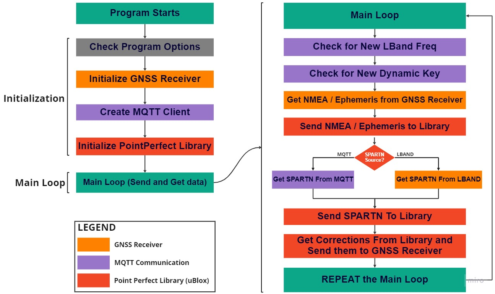

<div align="center">
  
# How to guide for DEVELOPER implementation of uBlox's PointPerfect Library for GNSS Corrections

## Authors
  
| Name | GitHub |
|------|--------|
| Iker Uranga | <a href="https://github.com/IkerUranga10">IkerUranga10</a> </br> |    
| Duck Jiang | <a href="https://github.com/duckjiang">duckjiang</a> </br> |  
   
## Septentrio Links for Users  
  
| Support                                                                          | Contact                                                                          | Septentrio Home Page                                                        |
|----------------------------------------------------------------------------------|----------------------------------------------------------------------------------|-----------------------------------------------------------------------------|
| <a href="https://web.septentrio.com/GH-SSN-support ">Septentrio Support Page</a> | <a href="https://web.septentrio.com/GH-SSN-contact ">Septentrio Contact Page</a> | <a href="https://web.septentrio.com/UBL-SSN-home">Septentrio Home Page</a> |

This guide is part of a collection of documentation on integration and implementation of third party correction services with Septentrio receivers for high accuracy positioning. This collection of documentation is intended to provide our customers with **practical examples of how they can integrate the correction services they use or want to use** with their positioning system containing a Septentrio module. Also, all these guides are based on implementing them in the same setup example that you can see in <a href="https://github.com/septentrio-gnss/SeptentrioAgnostic/tree/main/Receiver%20and%20Raspberry%20Setup#set-up-guide-to-use-third-parties-corrections-with-septentrios-receiver-for-precise-positioning">this section</a>.

| <a href="https://github.com/septentrio-gnss/SeptentrioAgnostic#set-up-guide-to-use-third-party-osr-and-ssr-correction-services-with-septentrios-receivers-for-precise-positioning">To access the main GitHub page for this collection of documentation click on this link</a> |
|---|

| <a href="https://web.septentrio.com/GH-SSN-modules ">To visit the page where we offer our different GNSS modules, click here</a> |
|---|
   
## DISCLAIMER
  
As discussed above, this set of guidelines are a practical example to help Septentrio Module users and developers to integrate third party fixes. The guidelines are based on a concrete setup, which you may or may not use to follow the guidelines.

We would like you to mention our disclaimer about that setup and the guides in general before starting reading this guide.
  
| <a href="https://github.com/septentrio-gnss/SeptentrioAgnostic/tree/main/Receiver%20and%20Raspberry%20Setup#disclaimer">Click here to know more about or Setup and and general implementation documentation disclaimer</a> |
|---|

</div>

## License: 

## TABLE OF CONTENTS

<!--ts-->

* [Introduction](#introduction)
* [Different operating modes](#introduction)
* [Main parts of the code](#main-parts-of-the-code)
  * [Initialization part](#initialization-part)
  * [Main loop part](#main-loop-part)
* [Code dependencies](#code-dependencies)
* [Download the Glue Code](#download-the-glue-code)
* [List of parameters](#list-of-parameters)
  * [General program logic parameter list](#general-program-logic-parameter-list)
  * [Logging Configuration parameter list](#logging-configuration-parameter-list)
  * [Serial Communication parameter list](#serial-communication-parameter-list)
  * [MQTT Configuration parameter list](#mqtt-configuration-parameter-list )
* [Code compilation](#code-compilation)
* [Code execution](#code-execution)
* [Testing](#testing)
* [Suggestions and improvements](#suggestions-and-improvements)
  
<!--te-->

## INTRODUCTION

This documentation is a user implementation guide for integrating PointPerfect correction services into an example system setup based on Mosaic-Go + Raspberry Pi 4. The guide to set up this setup is documented in the link below. It is a sample guide so that you can implement your own based on this system or other similar systems should you wish to do so. On Septentrio's side only tests have been done with this setup.

<div align="center">

| <a href="https://github.com/septentrio-gnss/SeptentrioAgnostic/tree/main/Receiver%20and%20Raspberry%20Setup#set-up-guide-to-use-third-parties-corrections-with-septentrios-receiver-for-precise-positioning">Click here to visit Mosaic-Go + Raspberry Pi 4 setup preparation</a> |
|---|
   
</div>

This way any user who has such a setup ready can start using and testing the corrections.

However, the ultimate goal of the guide is to provide an example of integration to a similar system that works with a septentrial receiver, in this case Mosaic-Go, and with an external CPU, in this case the Raspberry Pi 4.

## DIFFERENT OPERATING MODES

The different operating modes vary depending on the SPARTN data source. As discussed in the <a href="https://github.com/septentrio-gnss/uBloxCorrectionsWithSeptentrio/blob/master/README.md#point-perfect-library">PointPerfect Library</a> section, there are two possible sources of SPARTN data, either through an <a href="https://github.com/septentrio-gnss/uBloxCorrectionsWithSeptentrio/blob/master/README.md#mqtt">MQTT</a> broker or through the beam of an LBand satellite that broadcasts this data.

Therefore, the **selection of the SPARTN data source conditions some elements of the system**, such as which topics to subscribe to for MQTT communication or whether a continuous Internet connection is required or not.

Thus, from now on we will refer to two modes of operation, these are **LBand Mode** and **MQTT Mode**. The selection and configuration of these operating modes is done through the different execution parameters of the compiled code, as described in the <a href="https://github.com/septentrio-gnss/uBloxCorrectionsWithSeptentrio/blob/master/user/README.md#list-of-parameters">parameter list section</a>.

## MAIN PARTS OF THE CODE

<p align="center">
    

First of all, the most important thing about the structure of the code and its flow is that it has an initialization part and another part that contains a loop in which it will be running indefinitely or for a certain time (the latter is done by a timer, more information in the <a href="https://github.com/septentrio-gnss/uBloxCorrectionsWithSeptentrio/blob/master/user/README.md#list-of-parameters">parameter list section</a>).
  
As the first part of the initialization, there is the **Check Program Options** part, which is responsible for collecting all the configuration of the parameters entered by the user, in order to **run the program based on these parameters**.

Secondly, there is a part of the code that opens a serial port communication with the septentrio receiver and by **sending commands it is configured to operate in the correct way for the selected mode** (Remember, LBand mode or MQTT Mode). There is also the option to send or not to send commands, as the user wishes, by means of an execution parameter.
  
The next step of the initialization of the program is the creation of an MQTT client, its configuration and connection to the broker, in this way we will be able to access the MQTT topics. It is important to mention that in order to connect to this MQTT broker it is necessary to download several files and to have access to a password. These credentials are obtained by purchasing a plan of uBlox correction services for PointPerfect through the  <a href="https://thingstream.io">Thingstream platform</a>. If you have any questions about accessing this service or your keys through this platform, please contact uBlox support. As the last step of the initialization block, the PointPerfect library is initialized depending on the mode (LBand mode or MQTT Mode) selected by the user in the parameters. 

After initialization is complete, the main loop begins, which will run until the user manually stops the program, runs out of execution time (if the user has configured it to do so), or some other critical failure occurs.

In resume, the main loop continuously repeats the following steps:

- Receives Ephemeris and NMEA from the receiver and sends them to the library.

- Receives SPARTN data from the SPARTN data source selected by the user and sends it to the library.

- Once the library has access to the information from the two previous points, if the information is of sufficient quality, it will produce RTCM correction data and it will be sent to the receiver.

In the following two sub-sectinos called <a href="https://github.com/septentrio-gnss/uBloxCorrectionsWithSeptentrio/tree/master/dev#initialization-part">Initialization part</a> and <a href="https://github.com/septentrio-gnss/uBloxCorrectionsWithSeptentrio/tree/master/dev#main-loop-part">Main loop part</a>, a more detailed description of the code is given. Its porpuse is to give a general overview of the code logic of each block of the program (<a href="https://github.com/septentrio-gnss/uBloxCorrectionsWithSeptentrio/blob/master/dev/doc_sources/gluecode_diagram.jpg">shown in this picture</a>) while mentioning which of the imported libraries are been used and why.

### Initialization part

<details>
<summary>Check program Options</summary>

In this part of the code, the options selected by the user are shown by means of the different flags that appear in the <a href="https://github.com/septentrio-gnss/uBloxCorrectionsWithSeptentrio/tree/master/dev#list-of-parameters">parameter list</a>. This code block is also in charge of assigning the value of the options to a structure called **Program Options**, which will be used to execute the different blocks of the code in the correct way, adapting to the options specified by the user.
  
</details>
  
<details>
<summary>Initialize GNSS Receiver</summary>

This code block is responsible for opening a serial port for communication between the Raspberry PI and the Receiver. In case the user has specified that the program should run in LBand mode, another secondary serial port will also be opened to transmit the raw LBand data from the receiver to the Raspberry Pi. In both cases, the serial port parameters are also obtained from the program options.

Once the serial port is opened, also depending on the user options, the program will send or not some commands to configure the receiver in the appropriate way for the operation of the program. Some of the commands sent for receiver configuration in this block contain information obtained from the configuration parameters entered by the user in the run command, and there is also a program option to send a factory reset configuration command to the receiver. 
  
</details>
  
<details>
<summary>Create MQTT Client</summary>
  
For the creation, configuration and operation of the MQTT client, this part of the program uses files available on the <a href="https://thingstream.io">Thingstream platform</a> for authentication for the connection to the MQTT broker of the PointPerfect location service and the client ID entered by the user in the program options. In addition, it subscribes to the topics necessary for the operation of the program, also specified by the user in the program options.
  
</details>
  
<details>
<summary>Initialize PointPerfect Library</summary>
  
This part is responsible for initializing the PointPerfect Library, adapted to the operating mode. To do this, the library is initialized with a parameter depending on the operating mode and is authenticated through the information of the dynamic key coming from an MQTT topic.

</details>
  
### Main loop part

<details>
<summary>Check for New LBand Frequency</summary>
  
Each iteration of the main loop checks if there is a new LBand frequency available from the MQTT topic, in case LBand data is used, for the **Lb** and **Dual** operation mode. If you are using one of these two operating modes and there is also a new frequency, the program takes care of updating this information in the receiver by sending a new command through the serial port, in a similar way as it is done in the initialization part of the GNSS receiver.

</details>  
  
<details>
<summary>Check for New Dynamic Key</summary>

Each iteration of the main loop checks if there is a new Dynamic Key available from the MQTT topic, regardless of the operation mode. If there is a new Dynamic Key available, the program takes care of updating this information in the receiver by sending a new command through the serial port, in a similar way as it is done in the initialization part of the GNSS receiver.  
  
</details>  
  
<details>
<summary>Get NMEA / Ephemeris from GNSS Receiver</summary>
 
As discussed in the <a href="https://github.com/septentrio-gnss/uBloxCorrectionsWithSeptentrio#point-perfect-library">PointPerfect Library section</a>, the library first needs Ephemeris and NMEA information from the receiver, so this part of the code takes care of receiving that information and sending it to the library.

</details>   
  
<details>
<summary>Get SPARTN data from MQTT or LBand</summary>
  
This part of the code is responsible for obtaining SPARTN corrections from the SPARTN corrections source selected by the user in the program options section. If the source is LBand it gets the corrections through the secondary serial port connected to the receiver and if the source is MQTT it gets the corrections from an MQTT topic. In case the operation mode is Dual, the program performs both operations of obtaining SPARTN data from both sources.  
  
</details>  
  
<details>
<summary>Send SPARTN data to Library</summary>
  
As discussed in the <a href="https://github.com/septentrio-gnss/uBloxCorrectionsWithSeptentrio#point-perfect-library">PointPerfect Library section</a>, the library needs the corrections in SPARTN format to decode them and with this information, together with the Ephemeris and NMEA information from the receiver, it can compute the corrections in RTCM v3 format that will later be sent to the receiver.

This part of the program is responsible for obtaining the SPARTN information from the source specified by the user and sending it to the library. This source can be LBand obtained through the receiver's auxiliary serial port, or it can be obtained through an MQTT topic.

</details>  
  
<details>
<summary>Get corrections from Library and send them to GNSS Receiver</summary>
  
Once the library has the SPARTN and Ephemeris + NMEA information, if the data quality is adequate, it will start to produce corrections in RTCM v3 format that will be sent to the receiver. This part of the program takes care of obtaining these RTCM corrections, in case the library has produced them, and sends them to the receiver through the main serial port.

</details>  

## CODE DEPENDENCIES

The code has some dependencies that are third-party libraries beyond the standard libraries. These third-party libraries, except for the PointPerfect Library, are Open-Source with MIT license. These are the steps for installing all the dependencies:

1- Update the package index:
```
sudo apt-get update
```

2- Install g++-10 deb package:
```
sudo apt-get install g++-10
```

3- Install nlohmann json library for Debian 11
```
sudo apt install nlohmann-json3-dev 
```

4- Install mosquitto library for Debian 11
```
sudo apt-get install libmosquitto-dev -y
```

5- Install BOOST Libraries
```
sudo apt-get install libboost-all-dev
```

6- Update the package index:
```
sudo apt-get update
```

Additionally, PointPerfect LIbrary is also a dependency, but it is already in the repository.

## DOWNLOAD THE GLUE CODE
  
To download the code, simply clone this repository, since the cluecode is located inside it, specifically in the folder called 'gluecode'. To clone the repository, enter the following command in the terminal:
  
```
git clone https://github.com/septentrio-gnss/uBloxCorrectionsWithSeptentrio.git
```  
For obtaining the PointPerfect library please consult uBlox. Then put it in the pp folder inside include directory and make sure that the path to it is correct.

## LIST OF PARAMETERS

Below are several tables with all the information about the gluecode execution arguments. These are divided into 4 sections, each with a different theme.

<div align="center">

### General program logic parameter list

| **Name / Label** |                  **Definition**                 |  **Default Values**  |                     **Possible Values**                    |                 **Example**                | **Required** |
|:----------------:|:-----------------------------------------------:|:--------------------:|:----------------------------------------------------------:|:------------------------------------------:|:------------:|
|       mode       |         Sets the general program logic.         | **No default value** |                       Ip, Lb or Dual                       |             --mode Ip --mode Lb            |    **YES**   |
|       echo       |  Option to enable/disable messages in terminal  |       **true**       |                        true or false                       |          --echo true --echo false          |    **NO**    |
|   reset_default  | If send_cmds enabled, sends copy default config |       **true**       |                        true or false                       | --reset_default true --reset_default false |    **NO**    |
|     send_cmds    |   If enabled, sends the minimal needed config.  |       **true**       |                        true or false                       |     --send_cmds true --send_cmds false     |    **NO**    |
|       timer      |             Enables timer in seconds            |         **0**        | 0 => Timer disabled  More than 0 => That number of seconds |                 --timer 120                |    **NO**    |
  
</div>

These are of general purpose, and serve to establish the behavior of the program at the level of functionality and operation.

### Logging Configuration parameter list

<div align="center">

|   **Name / Label**  |                       **Definition**                      | **Default Values** |     **Possible Values**    |             **Example**            | **Required** |
|:-------------------:|:---------------------------------------------------------:|:------------------:|:--------------------------:|:----------------------------------:|:------------:|
|    SPARTN_logging   | Enable and name SPARTN Log file                           |      **none**      |    File Name by the user   |    --SPARTN_Logging sptartn_test   |    **NO**    |
|     SBF_Logging     | Enable SBF Logging and give a name to the file            |      **none**      |    File Name by the user   |       --SBF_Logging van_test       |    **NO**    |
|  SBF_Logging_config | If SBF_Logging enabled, select sbf stream and interval    |      **none**      | [select stream]@[interval] |  --SBF_Logging_config Support@sec1 |    **NO**    |
|     NMEA_Logging    | Enable NMEA Logging  and give a name to the file          |      **none**      |    File Name by the user   |       --NMEA_Logging van_test      |    **NO**    |
| NMEA_Logging_config | If NMEA_Logging enabled, select NMEA stream and interval. |      **none**      | [NMEA Messages]@[interval] | --NMEA_Logging_config GGA+ZDA@sec1 |    **NO**    |
  
</div>
 
These parameters define whether SPARTN data logging is to be performed from the SPARTN data source (MQTT or LBand) or from the receiver status information via NMEA or SBF (Septentrio Binary Format) message types.
  
### Serial communication parameter list

<div align="center">

|  **Name / Label** |   **Definition**   |  **Default Values**  | **Possible Values** |               **Example**              | **Required** |
|:-----------------:|:------------------:|:--------------------:|:-------------------:|:--------------------------------------:|:------------:|
|     main_comm     | Select between USB | **No default value** |         USB         |             --main_comm USB            |    **YES**   |
|  main_comm_config | Configure for USB  | **No default value** |  [port]@[baudrate]  | --main_comm_config /dev/ttyACM0@115200 |    **YES**   |
|     lband_comm    | Select between USB |       **none**       |         USB         |            --lband_comm USB            |    **NO**    |
| lband_comm_config | Configure for USB  |       **none**       |   [address]@[port]  | --main_comm_config /dev/ttyACM1@115200 |    **NO**    |
  
</div>

These parameters are used to configure the serial communication with the receiver. The main channel is mandatory but the LBand channel is required only if the selected operating mode is LBand Mode.
  
### MQTT Configuration parameter list 

<div align="center">

| **Name / Label** |     **Definition**     |       Default Values       |                **Possible Values**               |           **Example**          | **Required** |
|:----------------:|:----------------------:|:--------------------------:|:------------------------------------------------:|:------------------------------:|:------------:|
|     client_id    | Set the MQTT Client ID |    **No default value**    |                Any valid client id               | --client_id [client id number] |    **YES**   |
|    mqtt_server   | Set the MQTT Server    | **pp.services.u-blox.com** |               Server never changes               | --mqtt_server [server address] |    **NO**    |
|      region      | Set the MQTT Region    |           **eu**           | UBlox coverage available regions (see their web) |           --region eu          |    **NO**    |

</div>

These parameters are used to configure the MQTT client. Normally only the client ID, obtained from the thingstream platform, is required.
    
## CODE COMPILATION
  
For compiling the code, just navigate to the src folder and execute the folloginc command:

```
g++ -std=c++11 -o ../build/gluecode gluecode.cpp \
-I../include/pointPerfect/PPL_64_Bit/inc/ \
-I../include/mqtt/ \
-I../include/serialComm/ \
-L../include/pointPerfect/PPL_64_Bit/lib \
-lmosquitto \
-lpointperfect \
-pthread \
-lboost_system \
-lboost_thread \
-lboost_program_options
```

## CODE EXECUTION

These are the basic command executions, without using all the available parameters, see this section to know more about the <a href="https://github.com/septentrio-gnss/uBloxCorrectionsWithSeptentrio/tree/master/dev#list-of-parameters">program's parameters</a>.

Navigate to src folder and run:

RUN WITH MQTT - (With Basic options)
```
./build/gluecode --mode Ip \
--main_comm USB --main_config /dev/ttyACM0@115200 \
--client_id <your_client_ID_here> 
```

RUN WITH LBAND - (With Basic options)
```
./build/gluecode --mode Lb --main_comm USB --main_config /dev/ttyACM0@115200 \
--lband_comm USB --lband_config /dev/ttyACM1@115200 \
--client_id <your_client_ID_here>
```

## TESTING

To test the code, a script has been created to run the compiled binary code file called 'gluecode'.

The purpose of the script is to run the executable several times to make the receiver work with corrections with different <a href="https://github.com/septentrio-gnss/uBloxCorrectionsWithSeptentrio/blob/master/dev/README.md#list-of-parameters">program execution arguments</a> (configuration). The purpose of the test is to check the performance of the corrections in the receiver. The code is not designed to test the performance of the code itself, as <a href="https://github.com/septentrio-gnss/uBloxCorrectionsWithSeptentrio/tree/master/dev#suggestions-and-improvements">there are some things that could be improved</a> because this code is a sample code to help users and developers to implement the Pointperfect library in their system based on this code.

<div align="center">

| <a href="https://github.com/septentrio-gnss/uBloxCorrectionsWithSeptentrio/tree/master/gluecode/testing#testing-septentrios-gluecode-for-working-with-ubloxs-pointperfect-correction-services-for-precise-positioning">Click here to navigate to Testing Septentrio's gluecode for working with uBlox's Pointperfect correction services for precise positioning guide</a> |
|---|
   
</div>

## SUGGESTIONS AND IMPROVEMENTS
  
There are several thing that could be improved in the code for a better performance, stability or to be more user friendly. These things are listed here. If you want to contribute or you have some feedback or suggestion do not hestitate to share it with us!
  
<div align="center">

| <a href="https://github.com/septentrio-gnss/uBloxCorrectionsWithSeptentrio#suggestions-for-improvements">Click here to navigate to Suggestions and Improvements section</a> |
|---|
   
</div>
  
